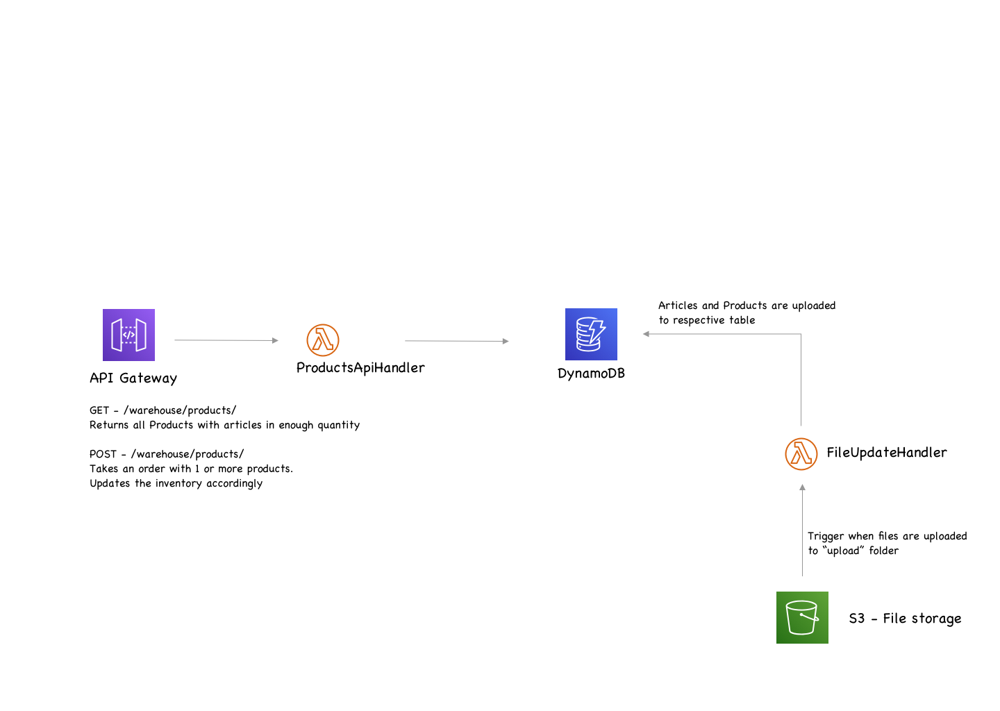
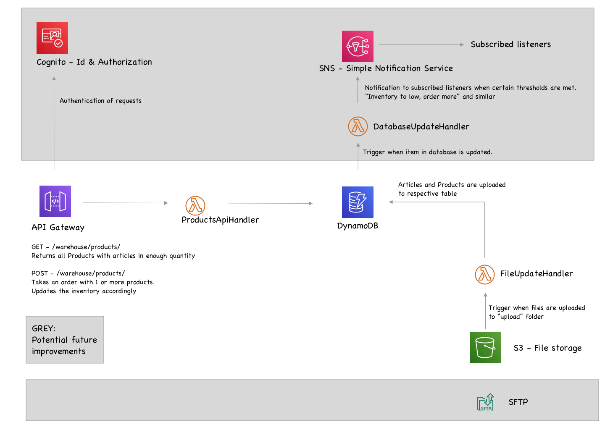

#Warehouse  management solution

The solution is developed to be fully serverless, running on the AWS  plaform.
Serverless functions are developed in JAVA. 
The entire solution is deployed through a Cloudformation script, setting up all required services and functions.

The architecure is as follows:


Files to be uploaded to the database are put in an S3 bucket, where a trigger notifies a Lambda function,
The Lambda reads the file and adds the contents to the database.
An API Gateway receives REST request and sends them to another lambda which queries the database and transforms the data as needed, before returning a response.

## Compromises
The time available forced a number of compromises along the way.
Error handling is limited, more time can be spent on when data is not in assumed format.

Testing, specifically unit tests, is an area where time just got in the way.
Authentication and Authorization should be added. 

The database model is not a neat as I  would like. With a bit of time, it will probably be possible to combine into one. 
A couple of secondary indexes would also make some of the queries easier and avoid having to do multiple queries.

Logging is also an area in need of more work. Both as part of error handling and identifying problem areas, and also for analytics.
##  Future 



Using AWS  Cognito for authorization would be a quick way to solve this problem.

Setting up a notification system, would probably be needed to easily communicate with other internal and external services.

Connecting a SFTP service to the S3 would make it easier to upload updated inventory data. 

##  Assumptions
* Only one warehouse
* The main function is to report and update inventory and stock availability. We assume that there are other services which handles the order itself. (I admit that there  might be some grey areas in the naming of some methods)  

##Installation

* During the creation of the stack the first time, there may sometimes be problems with the notificationconfiguration of the S3 bucket. to get through this, just comment out that part during creation and then add it back in and run an update  of the stack.

``` 
  OrderMgmtS3bucket:
    Type: AWS::S3::Bucket
    DependsOn: FileUpdateFunction
    Description: "Bucket where inventory and product lists will be uploaded and where they will be read and stored in DynamoDB.
    After, the processed files will be moved to the history folder"
    Properties:
      Tags:
        - Key: ADMIN
          Value: !Ref Admin
        - Key: PROJECT
          Value: !Ref ProjectName
        - Key: ENVIRONMENT
          Value: !Ref Environment
  #    NotificationConfiguration:
  #      LambdaConfigurations:
  #        - Event: 's3:ObjectCreated:*'
  #          Filter:
  #            S3Key:
  #              Rules:
  #                - Name: prefix
  #                  Value: update/
  #          Function: !GetAtt FileUpdateFunction.Arn

```
* 